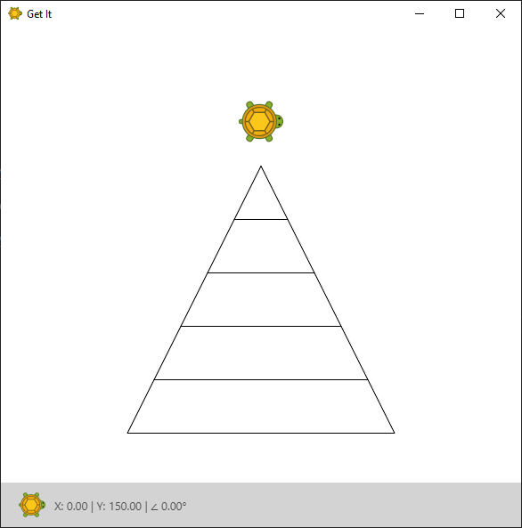
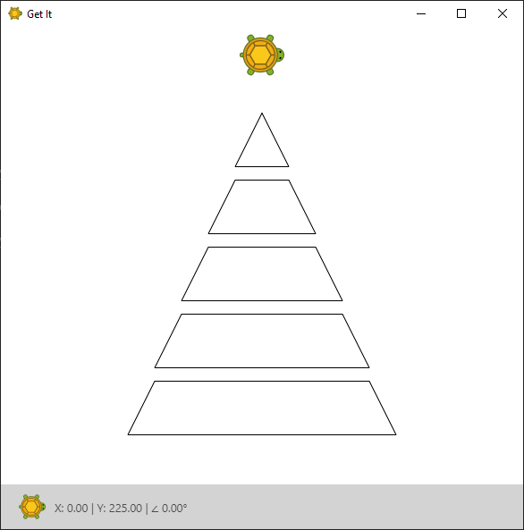

Didn't you always want to build your own pyramid?
Now you finally have the tools and knowledge to do just that.
Well, sort of. Our pyramid will only be two-dimensional and virtual, but hey, who cares?

Let's take a look at what we're going to build:

That'll be the final result.
You might not see by now what that exercise has to do with loops.
Maybe it becomes clearer if we put apart the different layers:

While every layer looks a bit differently they are all trapezes, right? Even the top one - while that one looks like a triangle it can also be seen as a trapeze where the length of the upper side is zero, but we'll come to that later.

This should already give you enough information about *what commands* to repeat. However we have to think about what *parameters* define our pyramid.

It should be clear that the top layer should look like a triangle, otherwise our pyramid would look incomplete.
But there are still many different ways to define the pyramid. For example our pyramid is fully defined by specifying the length of the bottom layer, the height of each layer and the number of layers, right? The angles and all lengths can then be calculated based on those parameters. Can you come up with a different set of parameters that fully define the pyramid?

Use this set of parameters and define a C# variable for each of them. Then draw all the layers until you reach the top. If you have to calculate some more values always do that using your set of parameters - they fully define the pyramid.
