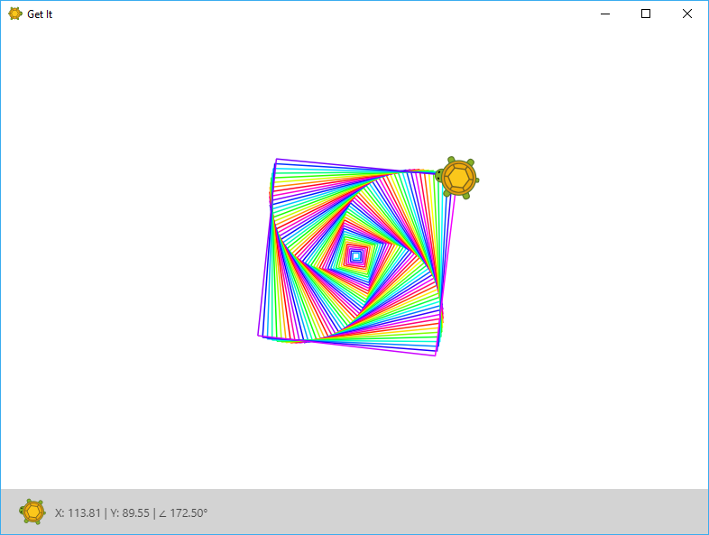
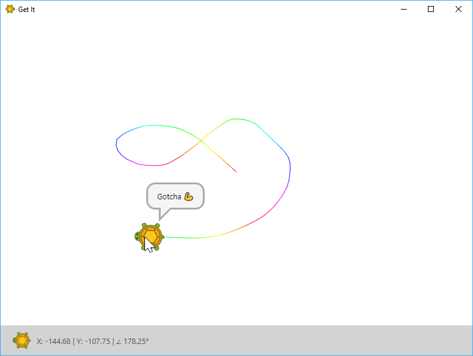
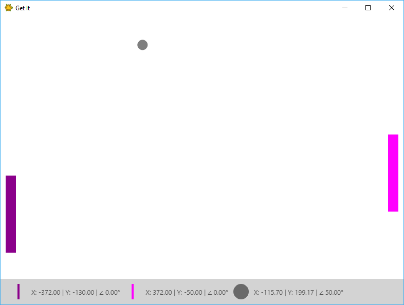
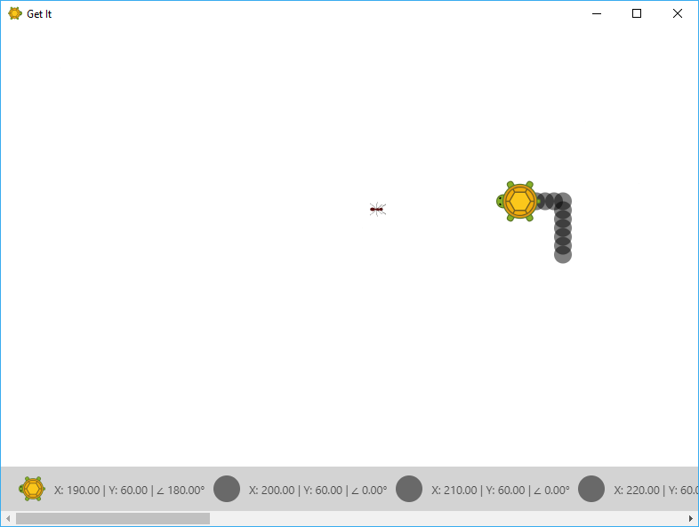

## What is *Get It*

*Get It* is a tool that helps people getting started with software development.
It's intended to be used by people that have no prior knowledge in software development.
*Get It* is heavily inspired by [Scratch](https://scratch.mit.edu/) and [Turtle graphics](https://en.wikipedia.org/wiki/Turtle_graphics).

## Nice, tell me more

*Get It* provides access to a 2D scene that can be programmed using C# - a popular [general-purpose programming language](https://en.wikipedia.org/wiki/General-purpose_programming_language). Using C# code you can create programs that customize the scene by adding players, moving them around, drawing with them and [much more](/features). Here are some screenshots of programs you can create:

And here is a video of how such a program is created:

> Note that this uses an older version of *Get It* where some commands have a different name.
